autofin
---

[](https://github.com/denisalpino/autofin)
[](https://github.com/denisalpino/autofin)
[](https://github.com/denisalpino/autofin)

Микро-библиотека для автоматизации предобработки финансовых данных, разработки ML/DL моделей, их анализа и поддержки. **Проект развивается из активных экспериментов**.

## 📑 Оглавление
- [🎯 Что делает библиотеку особенной?](#-что-делает-библиотеку-особенной)
- [🔬 Эксперименты](#-эксперименты)
  - [🔍 Разведывательный анализ](#-разведывательный-анализ)
    - [📉 Стационарность](#-стационарность)
    - [🎯 Шум и аномалии (винсоризация)](#-шум-и-аномалии-винсоризация)
    - [📊 Корреляционный анализ](#-корреляционный-анализ)
    - [⚡ Распределение доходностей](#-распределение-доходностей)
  - [⚙️ Обучение моделей](#️-обучение-моделей)
    - [🔍 Пространство поиска](#-пространство-поиска)
    - [⚙️ Фиксированные параметры](#️-фиксированные-параметры)
    - [📈 Метрики классификации по активам](#-метрики-классификации-по-активам)
  - [⚙️ Оптимизация торговой стратегии](#️-оптимизация-торговой-стратегии)
  - [🚀 Бэктестирование](#-бэктестирование)
    - [⚙️ Условия тестирования](#️-условия-тестирования)
    - [📊 Результаты торговых стратегий](#-результаты-торговых-стратегий)
    - [️⚠️ Поведение во флэте](#️️-поведение-во-флэте)
    - [️⚠️ Поведение на медвежьем рынке](#️️-поведение-на-медвежьем-рынке)
- [🚀 Быстрый старт](#-быстрый-старт)
  - [Установка](#установка)
  - [Минимальный рабочий пример](#минимальный-рабочий-пример)
- [🛠️ Как использовать: два подхода](#️-как-использовать-два-подхода)
  - [Декларативный режим (LowCode) — для быстрых экспериментов (В работе)](#декларативный-режим-lowcode--для-быстрых-экспериментов-в-работе)
  - [Императивный режим — для полного контроля (В работе)](#императивный-режим--для-полного-контроля-в-работе)
- [📁 Структура проекта (только важное)](#-структура-проекта-только-важное)
- [🎯 Ключевые компоненты](#-ключевые-компоненты)
  - [Data Loaders](#data-loaders)
  - [Feature Engineering](#feature-engineering)
  - [Time Series Splitting](#time-series-splitting)
  - [Visualization](#visualization)
- [🚀 Рекомендуемые конфигурации](#-рекомендуемые-конфигурации)
- [🧪 Тестирование и качество кода](#-тестирование-и-качество-кода)
- [📈 Дорожная карта развития](#-дорожная-карта-развития)
  - [🔥 Ближайшие задачи](#-ближайшие-задачи)
  - [🚀 В разработке](#-в-разработке)
  - [💡 Идеи для будущего](#-идеи-для-будущего)
- [🤝 Как внести вклад](#-как-внести-вклад)
- [📄 Лицензия](#-лицензия)
- [📞 Контакты](#-контакты)

---

## 🎯 Что делает библиотеку особенной?

| Особенность | Преимущество |
|-------------|--------------|
| **📊 Data-Centric архитектура** | Компоненты созданы на основе глубокого EDA финансовых временных рядов |
| **⚡ Двойной режим работы** | Быстрое прототипирование (LowCode) + полный контроль (императивный) |
| **🛡️ Защита от утечек** | Продвинутая кросс-валидация с группами и временными барьерами |
| **📈 Готовые финансовые фичи** | 20+ технических индикаторов, временные фичи, лаги "из коробки" |

## 🔬 Эксперименты

Библиотека создавалась в процессе активного исследования данных. Вот ключевые инсайты из нашего EDA:

### 🔍 Разведывательный анализ

#### 📉 Стационарность
Анализ показал, что прямые предсказания цен неэффективны.

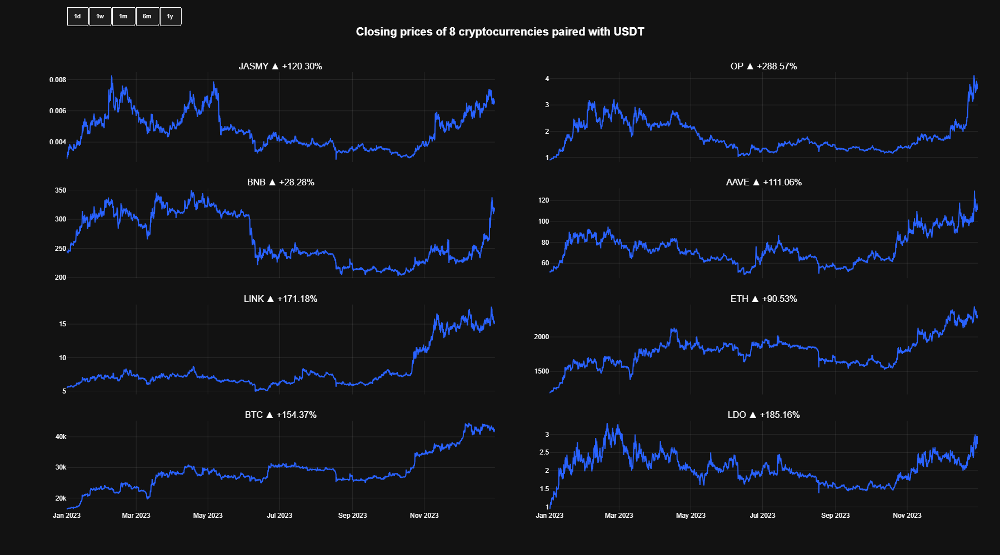

Решение — переход к прогнозу доходностей (более резкая кривая входа) или сигналов (простой способ перейти к торговой стратегии на основе бинарной классификации).

#### 🎯 Шум и аномалии (винсоризация)
Рассматривая доходность как признак можно обратить внимание на большое количество аномалий. 99.9% винсоризация значительно уменьшает влияние экстремальных значений, сохраняя структуру временного ряда.

<div align="center">
<table>
  <tr>
    <td align="center"><strong>До винсоризации</strong></td>
    <td align="center"><strong>После винсоризации</strong></td>
  </tr>
  <tr>
    <td>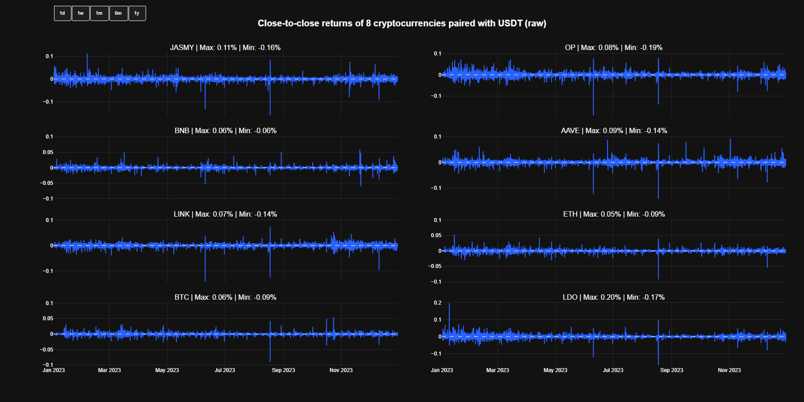</td>
    <td>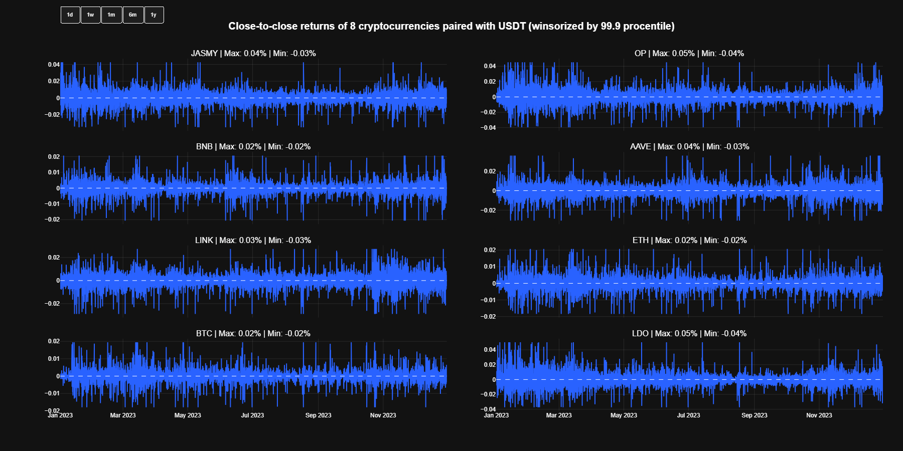</td>
  </tr>
  <tr>
    <td align="center"><em>Высокая волатильность, экстремальные выбросы</em></td>
    <td align="center"><em>Сглаженное распределение, сохранена структура</em></td>
  </tr>
</table>
</div>

#### 📊 Корреляционный анализ
Матрица корреляций выявила сильную мультиколлинеарность индикаторов с базовыми OHLC. Автоматический отбор фичей улучшает качество моделей.

**После отбора признаков:**


#### ⚡ Распределение доходностей
Анализ распределения помог выбрать оптимальные методы предобработки и валидации.

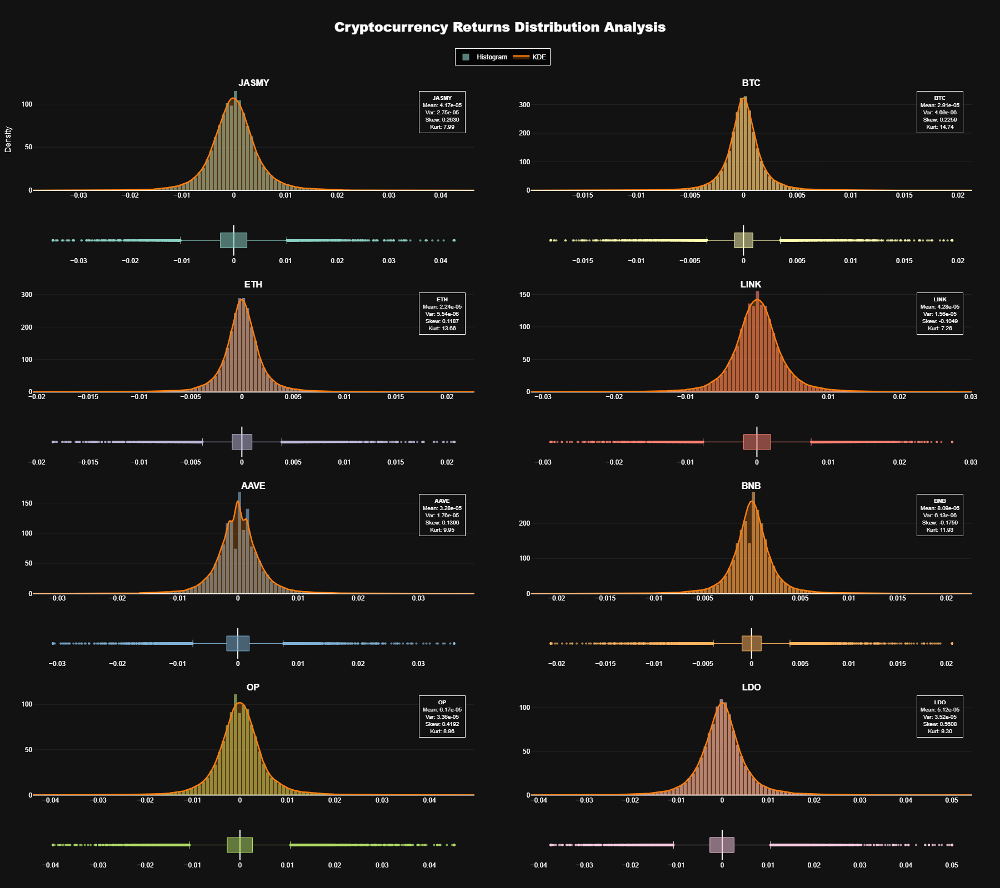

### ⚙️ Обучение моделей

Было проведено 3 эксперимента различного рода:
1. Первый подразумевал один набор гиперпараметров под все активы - результаты оказались вовсе неприменимыми.
2. Второй эксперимент заключачлся в оптимизации всех гиперпараметров на ранжирующеей способности посредством метрики $AUC$, однако в таком случае оказалось крайне затруднительно оптимизировать базовый порог из-за систематического смещения вероятностного распределения предсказаний классов. Калибровка вероятностей так же не помогла, так как смещение распределений происходило по моментам всех порядков вплоть до четвертого.
3. Последний и наиболее успешный эксперимент заключался в идее оптимизировать бОльшую часть гиперпараметров на $logloss$ вместо $AUC$, оставив последнюю метрику лишь для критерия ранней остановки по `n_estimators`. Как и ожидалось, смещение между вероятностыми распределениями по фолдам сильно уменьшилось.

Так, целевой метрикой для критерия ранней остановки была выбрана $AUC$, а оптимизация других гиперпараметров происходиила исключительно на минимизации $logloss$ посредством вероятностного алгоритма TPE с медианным прунером для экономии ресурсов. Чтобы нивелировать склонность деревянных моделей к переобуению, была применена кросс-валидация:
- Количество фолдов - 5 штук;
- Обучающая выборка - 3 месяца;
- Валидационные выборки - 1 неделя;
- Отступ между валидационными выборками - 45 дней;
- Тип окна - скользящее.

#### 🔍 Пространство поиска

| Параметр | Тип | Диапазон/Значения | Масштаб | Примечания |
|----------|-----|-------------------|---------|------------|
| `max_depth` | `int` | 3 - 10 | Линейный | Глубина дерева |
| `learning_rate` | `float` | 1e-4 - 0.3 | Логарифмический | Скорость обучения |
| `min_child_weight` | `float` | 0.1 - 10.0 | Логарифмический | Минимальный вес листа |
| `subsample` | `float` | 0.4 - 1.0 | Линейный | Доля выборки для обучения |
| `colsample_bytree` | `float` | 0.4 - 1.0 | Линейный | Доля признаков для дерева |
| `colsample_bylevel` | `float` | 0.4 - 1.0 | Линейный | Доля признаков по уровням |
| `reg_alpha` | `float` | 1e-8 - 1.0 | Логарифмический | L1 регуляризация |
| `reg_lambda` | `float` | 1e-8 - 1.0 | Логарифмический | L2 регуляризация |
| `max_bin` | `categorical` | 64, 128, 256, 512 | - | Количество бинов |

#### ⚙️ Фиксированные параметры

| Параметр | Значение | Описание |
|----------|-----------|-----------|
| `device` | `cuda` | Устройство для вычислений |
| `objective` | `binary:logistic` | Функция потерь для бинарной классификации |
| `eval_metric` | `auc` | Метрика для ранней остановки |
| `n_estimators` | 10000 | Максимальное количество деревьев |
| `early_stopping_rounds` | 100 | Ранняя остановка после 100 итераций |
| `random_state` | 42 | Seed для воспроизводимости |

#### 📈 Метрики классификации по активам
По активам LDO, JASMY и AAVE не удалось оптимиизировать гиперпараметры до приемлемого уровня. Так, для всех активов минимизированная метрика $logloss$ составила приблизительно 0.69 с малейшими отклонениями, что говорит о крайне плохой разделяющей способности и подтверждается вторичными метриками, такими как $F1_{macro}$, $Accuracy$ и $AUC$. Таким образом, торговая стратегия для данных активовне оптимизировалась.

<div align="center">

| Ассет | 𝓛<sub>log</sub> | $AUC$ | $Accuracy$ | $F1_{macro}$ |
|:------|:----------------:|:---:|:--------:|:------------------:|
| **ETH** | **0.6845** | **0.5787** | **0.5583** | **0.5560** |
| **BNB** | 0.6859 | 0.5667 | 0.5480 | 0.5420 |
| **BTC** | 0.6868 | 0.5740 | 0.5503 | 0.5500 |
| **OP** | 0.6882 | 0.5579 | 0.5366 | 0.5180 |
| **LINK** | 0.6884 | 0.5590 | 0.5387 | 0.5380 |
| **JASMY** | 0.6893 | 0.5510 | 0.5339 | 0.5340 |
| **AAVE** | 0.6906 | 0.5408 | 0.5280 | 0.4960 |
| **LDO** | 0.6908 | 0.5330 | 0.5169 | 0.4460 |

</div>

- **𝓛<sub>log</sub>** — Log Loss (логарифмическая функция потерь), *чем меньше → тем лучше*
- **AUC** — Area Under ROC Curve (площадь под ROC кривой), *чем больше → тем лучше*
- **Accuracy** — Точность классификации, *чем больше → тем лучше*
- **F<sub>1</sub> Score** — F-мера (среднее гармоническое точности и полноты), *чем больше → тем лучше*

### ⚙️ Оптимизация торговой стратегии

Байесовский оптимизатор стратегии

### 🚀 Бэктестирование

<div align="center">

#### ⚙️ Условия тестирования

<table style="width: 100%; border-collapse: collapse;">
  <tr>
    <td align="center">
      <strong>📊 Настройки тестирования</strong><br>
      <table>
        <tr><td>Комиссия за сделку</td><td>⚠️ 0.02%</td></tr>
        <tr><td>Проскальзывание</td><td>⚠️ 0.01%</td></tr>
        <tr><td>Период</td><td>⚠️ 84 дня</td></tr>
        <tr><td>Депозит</td><td>⚠️ $1,000</td></tr>
      </table>
    </td>
    <td align="center">
      <strong>🎯 Параметры стратегии</strong><br>
      <table>
        <tr><td>Регулирование магнитуды<br>входов</td><td>❌</td></tr>
        <tr><td>Переворот позиции</td><td>✅</td></tr>
        <tr><td>Базовый порог (τ)</td><td>✅</td></tr>
        <tr><td>Порог на вход<br>в лонг (Δ+)</td><td>✅</td></tr>
        <tr><td>Порог на выход<br>из лонга (ε-)</td><td>✅</td></tr>
        <tr><td>Порог на вход<br>в шорт (Δ-)</td><td>✅</td></tr>
        <tr><td>Порог на выход<br>из шорта (ε+)</td><td>✅</td></tr>
      </table>
    </td>
    <td align="center">
      <strong>🛡️ Управление рисками</strong><br>
      <table>
        <tr><td>Стоп-лосс</td><td>✅</td></tr>
        <tr><td>Тейк-профит</td><td>❌</td></tr>
        <tr><td>Трейлинг-стоп</td><td>✅</td></tr>
      </table>
    </td>
  </tr>
</table>

<br>

#### 📊 Результаты торговых стратегий

<table>
  <tr>
    <td align="center" width="50%" style="vertical-align: top;">
      <strong>BNB/USDT</strong>
    </td>
    <td align="center" width="50%" style="vertical-align: top;">
      <strong>LINK/USDT</strong>
    </td>
  </tr>
  <tr>
    <td align="center" style="vertical-align: top;">
      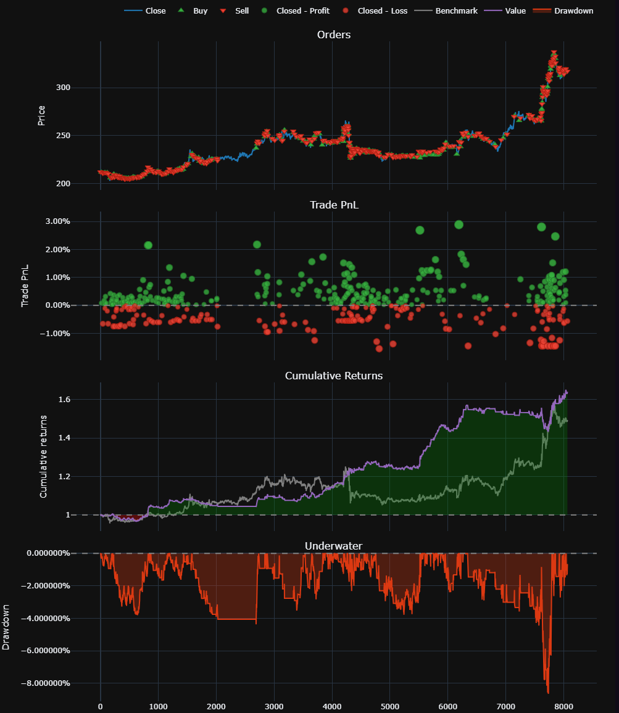
    </td>
    <td align="center" style="vertical-align: top;">
      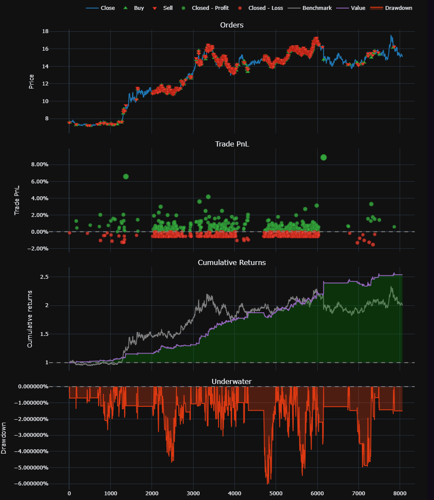
    </td>
  </tr>
  <tr>
    <td align="center" style="vertical-align: top;">
      <details>
        <summary><em>📈 Показать метрики BNB</em></summary>
        <pre>

End Value                        $1,640 ✅
Total Return                    +64.05% ✅
B&H Return                         +49.41%
Total Fees Paid                       $249
Max Drawdown                         8.65%
Max Drawdown Duration     15 days 04:00:00
Total Trades                           507
Win Rate                         62.52% ✅
Best Trade                          +2.89%
Worst Trade                         -1.55%
Avg Winning Trade                +0.45% ⚠️
Avg Losing Trade                 -0.48% ⚠️
Profit Factor                      1.54 ✅
Expectancy                        $1.26 ✅
Sharpe Ratio                       6.55 ✅
        </pre>
      </details>
    </td>
    <td align="center" style="vertical-align: top;">
      <details>
        <summary><em>📈 Показать метрики LINK</em></summary>
        <pre>

End Value                        $2,539 ✅
Total Return                   +153.87% ✅
B&H Return                        +101.85%
Total Fees Paid                       $585
Max Drawdown                         6.05%
Max Drawdown Duration               7 days
Total Trades                           855
Win Rate                         52.05% ⚠️
Best Trade                          +8.86%
Worst Trade                         -1.54%
Avg Winning Trade                +0.59% ✅
Avg Losing Trade                 -0.41% ✅
Profit Factor                      1.54 ✅
Expectancy                         $1.8 ✅
Sharpe Ratio                       8.98 ✅
        </pre>
      </details>
    </td>
  </tr>

  <tr>
    <td align="center" width="50%" style="vertical-align: top;">
      <strong>ETH/USDT</strong>
    </td>
    <td align="center" width="50%" style="vertical-align: top;">
      <strong>BTC/USDT</strong>
    </td>
  </tr>
  <tr>
    <td align="center" style="vertical-align: top;">
      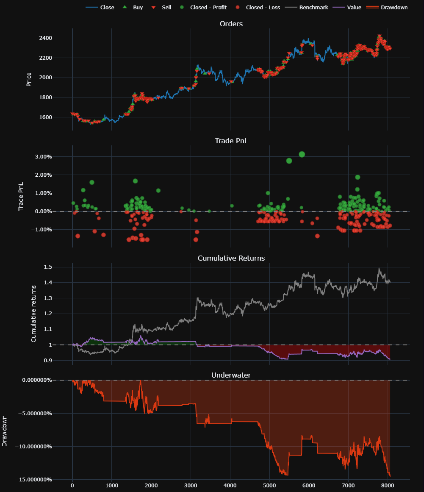
    </td>
    <td align="center" style="vertical-align: top;">
      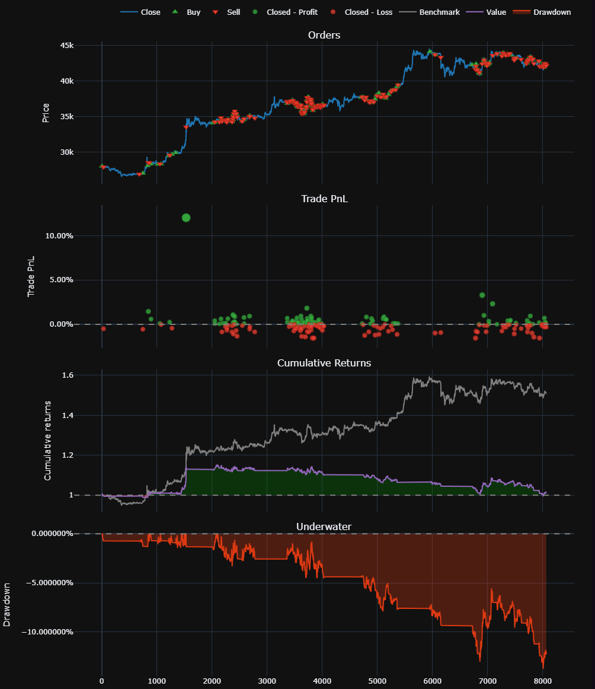
    </td>
  </tr>
  <tr>
    <td align="center" style="vertical-align: top;">
      <details>
        <summary><em>📈 Показать метрики ETH</em></summary>
        <pre>

End Value                          $905 ❌
Total Return                      -9.5% ❌
B&H Return                         +40.38%
Total Fees Paid                    $146.34
Max Drawdown                        14.56%
Max Drawdown Duration     65 days 22:00:00
Total Trades                           378
Win Rate                         55.03% ⚠️
Best Trade                          +3.13%
Worst Trade                         -1.55%
Avg Winning Trade                +0.32% ❌
Avg Losing Trade                 -0.45% ❌
Profit Factor                      0.87 ❌
Expectancy                       -$0.25 ❌
Sharpe Ratio                      -1.64 ❌
        </pre>
      </details>
    </td>
    <td align="center" style="vertical-align: top;">
      <details>
        <summary><em>📈 Показать метрики BTC</em></summary>
        <pre>

End Value                        $1,012 ⚠️
Total Return                      +1.2% ⚠️
B&H Return                         +50.87%
Total Fees Paid                        $95
Max Drawdown                        13.74%
Max Drawdown Duration     62 days 05:15:00
Total Trades                           218
Win Rate                         52.75% ⚠️
Best Trade                         +12.03%
Worst Trade                         -1.55%
Avg Winning Trade                +0.47% ❌
Avg Losing Trade                 -0.50% ❌
Profit Factor                      1.02 ❌
Expectancy                        $0.05 ❌
Sharpe Ratio                       0.33 ❌
        </pre>
      </details>
    </td>
  </tr>

  <tr>
    <td align="center" colspan="2" style="vertical-align: top;">
      <strong>OP/USDT</strong>
    </td>
  </tr>
  <tr>
    <td align="center" colspan="2" style="vertical-align: top;">
      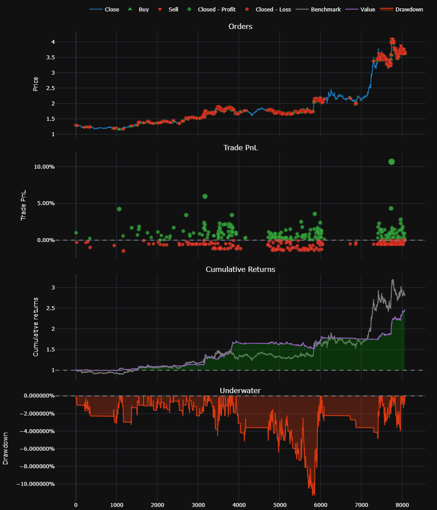
    </td>
  </tr>
  <tr>
    <td align="center" colspan="2" style="vertical-align: top;">
      <details>
        <summary><em>📈 Показать метрики OP</em></summary>
        <pre>

End Value                        $2,459 ⚠️
Total Return                     145.9% ⚠️
B&H Return                          179.6%
Total Fees Paid                      265.3
Max Drawdown                         11.4%
Max Drawdown Duration     21 days 10:30:00
Total Trades                           400
Win Rate                          53.5% ⚠️
Best Trade                          10.68%
Worst Trade                         -1.46%
Avg Winning Trade                 0.96% ✅
Avg Losing Trade                 -0.61% ✅
Profit Factor                      1.79 ✅
Expectancy                        $3.65 ✅
Sharpe Ratio                        9.1 ✅
        </pre>
      </details>
    </td>
  </tr>
</table>
</div>

#### ️⚠️ Поведение во флэте

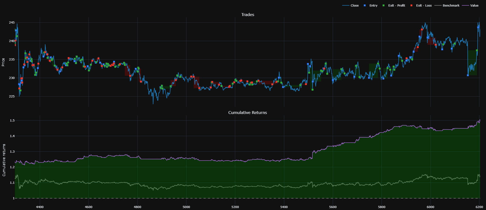

- Актив — BNB/USDT
- Период — 3 недели
- B&H — +1.2%
- Ours — +21.4%

#### ️⚠️ Поведение на медвежьем рынке

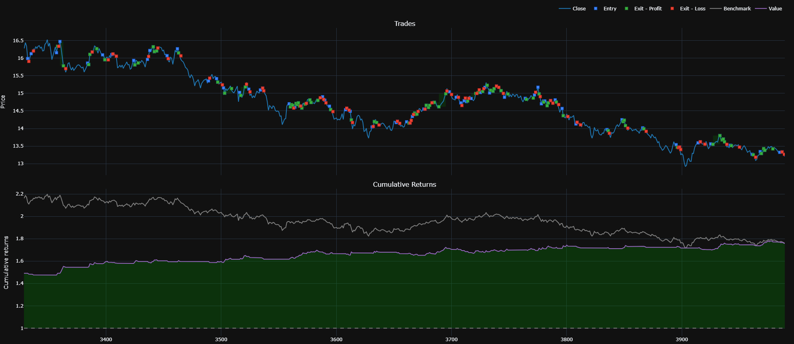

- Актив — LINK/USDT
- Период — 1 неделя
- B&H — -19.5%
- Ours — +17.9%


## 🚀 Быстрый старт

### Установка
```bash
git clone https://github.com/denisalpino/autofin.git
cd autofin
pip install -r requirements.txt
```

### Минимальный рабочий пример
```python
from src.data.loaders.data_loader import DataLoader
from src.features.feature_builder import FeatureBuilder
from src.config.config_loader import load_config

# Загрузка конфигурации (все настройки в одном месте)
config = load_config("configs/default.yaml")

# Загрузка данных (поддержка CSV/Parquet/Excel/JSON)
loader = DataLoader(config.data_loader)
dfs = loader.load("data/raw")  # Автоматически определяет формат
df = dfs[0]

# Построение признаков (20+ индикаторов готовы к использованию)
feature_builder = FeatureBuilder(config.features)
features_df = feature_builder.build_features(df)

print(f"Создано {len(features_df.columns)} признаков")
print(features_df[['timestamp', 'close', 'RSI_14', 'MACD_12_26_9']].tail())
```

## 🛠️ Как использовать: два подхода

### Декларативный режим (LowCode) — для быстрых экспериментов (В работе)

Создайте YAML-конфиг и запустите пайплайн:

```yaml
# configs/quick_experiment.yaml
data_loader:
  mapping:
    timestamp: timestamp
    open: open
    high: high
    low: low
    close: close
    volume: volume

features:
  time_features: [HOUR_SIN, HOUR_COS, DAY_OF_WEEK_SIN]
  returns:
    column: close
    method: PERCENT
    period: 1
  indicators:
    - name: RSI
      window: 14
    - name: MACD
      short_window: 12
      long_window: 26
    - name: ATR
      window: 14
  lags:
    - columns: [returns]
      lags: [1, 2, 3, 5, 10]

splitting:
  mode: group_time_series
  params:
    k_folds: 5
    train_interval: 4M
    val_interval: 7d
    test_interval: 14d
    padding: 45d
    window: rolling
```

```python
from src.config.config_loader import load_config
from src.pipeline import Pipeline

config = load_config("configs/quick_experiment.yaml")
pipeline = Pipeline(config=config)

# Весь пайплайн выполняется автоматически
results = pipeline.run("data/raw")
```

### Императивный режим — для полного контроля (В работе)

Используйте отдельные компоненты там, где это нужно:

```python
import pandas as pd
from src.data.loaders.data_loader import DataLoader
from src.features.feature_builder import FeatureBuilder
from src.data.splitters.cross_validation import GroupTimeSeriesSplit

# Загрузка данных
loader = DataLoader()
dfs = loader.load("data/raw/*.csv")
df = pd.concat(dfs)

# Фича инжиниринг
feature_builder = FeatureBuilder()
features = feature_builder.build_features(df)

# Продвинутая кросс-валидация
cv = GroupTimeSeriesSplit(
    k_folds=5,
    val_interval="7d",
    train_interval="4M",
    test_interval="14d",
    padding="45d",
    window="rolling"
)

split_result = cv.split(
    groups=df['ticker'],
    timestamps=pd.to_datetime(df['timestamp'])
)

# Визуализация сплитов
fig = cv.plot_split(
    y=df['returns'],
    groups=df['ticker'],
    timestamps=pd.to_datetime(df['timestamp'])
    theme="dark",
    title="Cross-Validation Scheme"
)
fig.show()
```

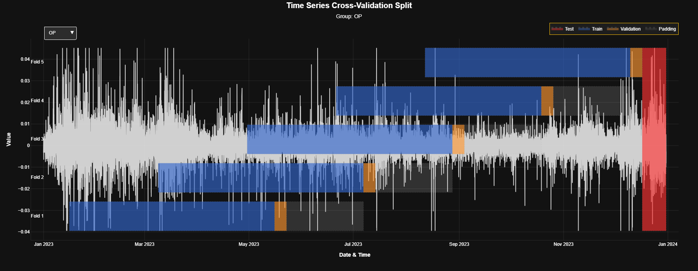

*Визуализация временных сплитов с группами — защита от утечек*

## 📁 Структура проекта (только важное)

```
autofin/
├── src/                   # Ядро библиотеки
│   ├── config/            # Pydantic-схемы для валидации
│   ├── data/              # Загрузка, обработка, разбиение
│   ├── features/          # 20+ технических индикаторов, лаговые и временные признаки
│   └── utils/             # Визуализация и утилиты
├── notebooks/             # 🧪 Живые эксперименты!
│   ├── 01_data_engineering/
│   └── 02_model_engineering/
├── docs/img/              # 📊 Все графики из EDA
└── tests/                 # ✅ Юнит-тесты
```

## 🎯 Ключевые компоненты

### Data Loaders
- **Умная загрузка**: автоматическое определение формата (CSV/Parquet/Excel/JSON)
- **Валидация данных**: проверка обязательных колонок (OHLC)
- **Маппинг колонок**: приведение к стандартным именам

```python
loader = DataLoader({
    'mapping': {'timestamp': 'date', 'close': 'price_close'},
    'read_options': {'sep': ';'}
})
```

### Feature Engineering
- **Временные фичи**: циклическое кодирование (час, день недели и т.д.)
- **Технические индикаторы**: RSI, MACD, ATR, Bollinger Bands (+15 других)
- **Статистики**: лаги, скользящие средние, доходности
- **Готовые конфиги**: оптимальные наборы фичей

### Time Series Splitting
- **Финансовая адаптация**: настройка временных интервалов, а не долей или количества наблюдений
- **GroupTimeSeriesSplit**: защита от утечек между тикерами
- **Временные барьеры**: padding между train/val/test
- **Скользящие окна**: expanding/rolling для реалистичной валидации

### Visualization
- **Графики цен/доходностей**: интерактивные Plotly-диаграммы
- **Матрицы корреляций**: тепловые карты с аннотациями
- **Диагностика моделей**: feature importance, кривые обучения

## 🚀 Рекомендуемые конфигурации

```yaml
features:
  time_features: [HOUR_SIN, HOUR_COS, MINUTE_SIN, MINUTE_COS]
  returns:
    method: LOG
    period: 1
  indicators:
    - name: RSI
      window: 14
    - name: ATR
      window: 10
  lags:
    - columns: [returns, RSI_14]
      lags: [1, 2, 3, 5, 10]
```

## 🧪 Тестирование и качество кода

```bash
# Запуск всех тестов
pytest -vv

# Тесты с покрытием
pytest --cov=src --cov-report=html
```

## 📈 Дорожная карта развития

### 🔥 Ближайшие задачи
- [ ] **AutoML для финансов**: автоматический подбор фичей и гиперпараметров
- [ ] **Ensemble модели**: комбинирование предсказаний нескольких моделей
- [ ] **Реальное бэктестирование**: интеграция с vectorbt

### 🚀 В разработке
- [ ] **LSTM**: Разработать пайплайн обучения LSTM-подобных моделей
- [ ] **Продакшн-готовность**: Docker, API, документация

### 💡 Идеи для будущего
- [ ] **LoRA**: Провести ряд эксперементов с трансфером LoRA на архитектуру LSTM
- [ ] **JEPA**: Интегрировать обучаемые эмбеддинги с CHARM архитектурой для многомерных временных рядов с описанием каналов данных
- [ ] **BI-аналитика**: подключить real-time и post-train дашборды на основе имеющихся визуализаций
- [ ] **Социальные сигналы**: интеграция с новостями и соцсетями

## 🤝 Как внести вклад

Библиотека растет из экспериментов — ваш опыт важен!

1. **Найдите проблему** или идею для улучшения
2. **Обсудите в issues** перед coding
3. **Сделайте форк** и создайте feature branch
4. **Добавьте тесты** для новой функциональности
5. **Обновите документацию** и примеры
6. **Откройте Pull Request** с описанием изменений

## 📄 Лицензия

На текущий момент проект распространяется под "All rights reserved". Мы активно рассматриваем переход на открытую лицензию (скорее всего MIT или Apache 2.0).

## 📞 Контакты

- **Author**: [Denis Alpino](https://github.com/denisalpino)
- **Repo**: [https://github.com/denisalpino/autofin](https://github.com/denisalpino/autofin)
- **Issues**: [Report a bug/idea](https://github.com/denisalpino/autofin/issues)
- **Discussions**: [Feature discussion](https://github.com/denisalpino/autofin/discussions)

---

> **💡 Проект живёт и развивается вместе с вашими экспериментами!** Каждая новая идея, баг-репорт или PR делает библиотеку лучше.

*Последнее обновление: Сентябрь 2025 г.*
